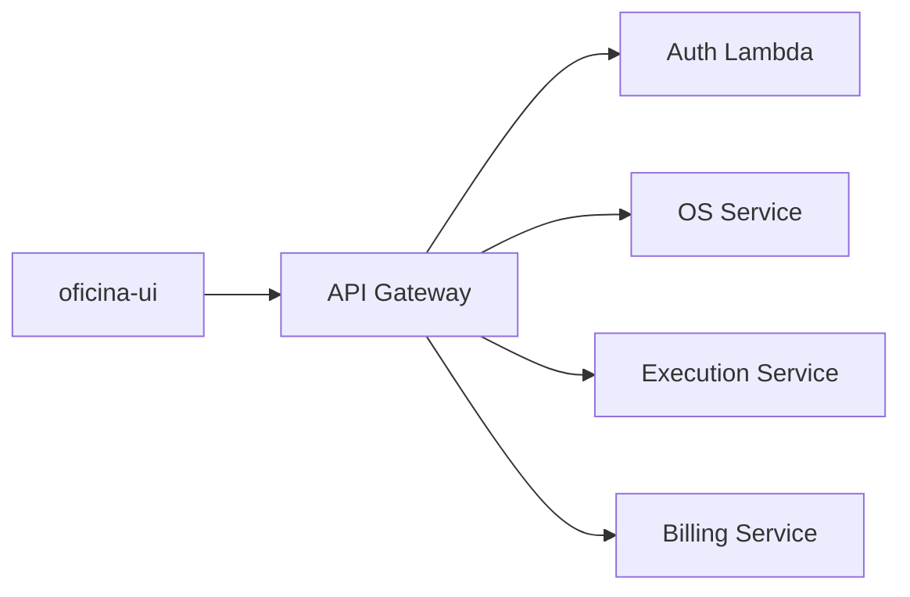

# oficina-ui

Interface operacional Angular da Oficina SOAT para recepção, administração e mecânicos.

## Estado

O repositório está na fase de governança e preparação. O scaffold Angular será criado após a conclusão dos guardrails, da auditoria dos contratos e do escopo do MVP.

## Princípio arquitetural

O frontend não contém regras de negócio. Ele coordena a experiência, chama as APIs e apresenta o resultado canônico. Autorização, cálculos, transições, estoque, Saga e pagamentos permanecem nos backends.

## Documentação

- [Arquitetura e guardrails](docs/architecture.md)
- [Escopo do MVP](docs/product-scope.md)
- [Prontidão das APIs](docs/api-readiness.md)
- [Wireframes](docs/wireframes.md)
- [Como contribuir](CONTRIBUTING.md)
- [Roadmap normativo](https://github.com/oficina-soat/oficina-platform/blob/main/docs/frontend/roadmap.md)
# oficina-ui
