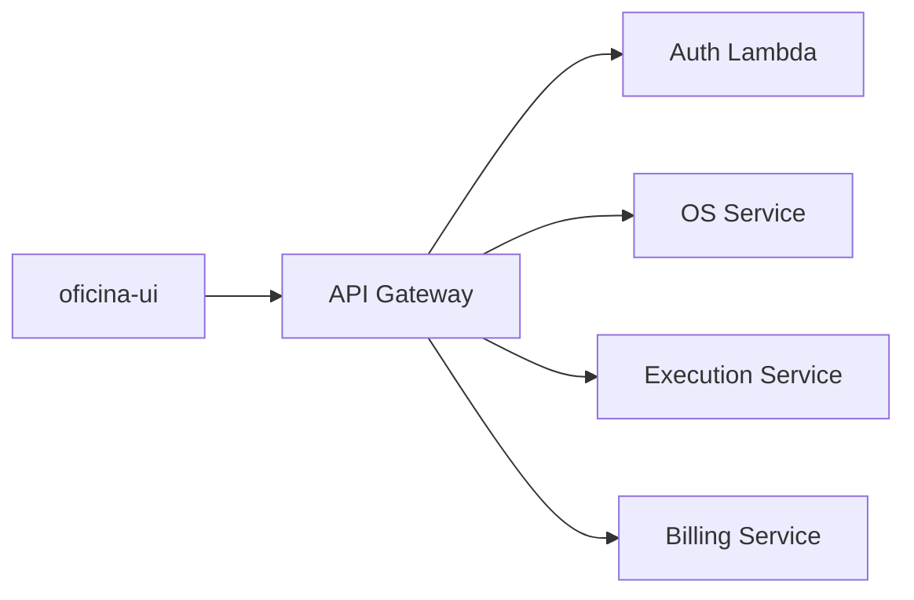

# oficina-ui

Interface operacional Angular da Oficina SOAT para recepção, administração e mecânicos.

## Estado

A fundação Angular e os guardrails arquiteturais estão ativos. O próximo incremento previsto é a integração tipada com os contratos OpenAPI dos backends.

## Desenvolvimento local

Requer Node.js `24.15.x` e npm `11.x`. Com o ambiente preparado:

```bash
npm install
npm start
```

A configuração de execução fica em `public/config/runtime-config.json` e pode ser substituída no deploy sem recompilar a aplicação.

Antes de cada commit, execute:

```bash
npm run validate
```

Esse comando verifica formatação, lint, fronteiras arquiteturais, testes com cobertura, build de produção e vulnerabilidades das dependências de produção.

## Princípio arquitetural

O frontend não contém regras de negócio. Ele coordena a experiência, chama as APIs e apresenta o resultado canônico. Autorização, cálculos, transições, estoque, Saga e pagamentos permanecem nos backends.



## Documentação

- [Arquitetura e guardrails](docs/architecture.md)
- [Escopo do MVP](docs/product-scope.md)
- [Prontidão das APIs](docs/api-readiness.md)
- [Wireframes](docs/wireframes.md)
- [Como contribuir](CONTRIBUTING.md)
- [Roadmap normativo](https://github.com/oficina-soat/oficina-platform/blob/main/docs/frontend/roadmap.md)
