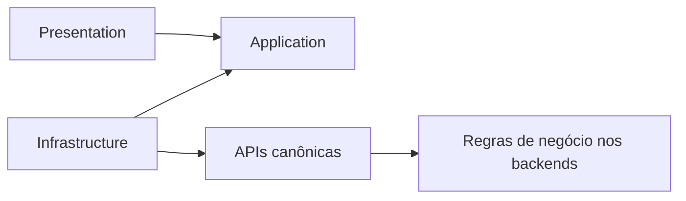

# Arquitetura e guardrails

## Princípio

O `oficina-ui` é uma interface operacional, não um domínio adicional. Ele coordena interação e apresenta respostas; os serviços decidem o resultado.



## Fronteiras

| Camada           | Pode conter                                               | Não pode conter                                                 |
| ---------------- | --------------------------------------------------------- | --------------------------------------------------------------- |
| `presentation`   | componentes, páginas, formulários, rotas, view state      | HTTP direto, DTO externo, regra de negócio                      |
| `application`    | coordenação, ports, estado efêmero, comandos da UI        | cálculo financeiro, transição de estado, autorização definitiva |
| `infrastructure` | adapters HTTP, DTOs, mappers, sessão, configuração        | componentes, decisão de negócio, estado visual                  |
| `shared/ui`      | elementos visuais reutilizáveis                           | semântica de Cliente, OS, Billing ou Execution                  |
| `core`           | autenticação, erro, correlação e configuração transversal | features ou abstrações genéricas sem uso comprovado             |

## Exemplos proibidos

```typescript
// Proibido: reproduz uma transição de negócio.
const podeIniciarReparo = os.estado === 'EM_EXECUCAO' && estoqueDisponivel;

// Proibido: calcula valor pertencente ao Billing.
const total = itens.reduce((soma, item) => soma + item.valor * item.quantidade, 0);
```

A UI deve apresentar ações fornecidas ou aceitas pela API e tratar a eventual rejeição canônica. Ocultar uma ação por papel ou estado recebido é somente melhoria de experiência; nunca é controle de segurança.

Os guards de rota leem apenas os papéis conhecidos do claim `groups` para evitar navegação acidental a áreas incompatíveis. Essa leitura local não valida a assinatura do JWT e não concede autorização: requisições continuam sendo enviadas com o token, e API Gateway/APIs validam assinatura, expiração e papel em cada operação protegida.

## Guardrails automatizados

- ESLint com zero warnings e proibição de `any`/imports restritos;
- TypeScript estrito;
- teste de dependências entre camadas e features;
- busca por `HttpClient` fora de `infrastructure`/`core/http`;
- proibição de armazenamento persistente de credenciais no navegador;
- orçamento de bundle e build de produção;
- testes unitários com cobertura;
- auditoria das dependências de produção.

O comando `npm run validate` executa o conjunto obrigatório. Testes de adapters, mappers, acessibilidade e E2E devem ser acrescentados junto aos fluxos que exercitam, sem esperar uma etapa posterior de estabilização.

## Contratos OpenAPI

Os snapshots em `contracts/openapi` vêm dos contratos canônicos do `oficina-platform`. O fluxo é:

1. `npm run api:sync` copia os contratos do repositório irmão, aceitando `OFICINA_PLATFORM_DIR` quando ele estiver em outro caminho;
2. `npm run api:generate` recria os tipos contratuais dentro de `infrastructure/generated` de cada feature;
3. adapters HTTP escritos manualmente consomem esses tipos e mapeiam DTOs para contratos da camada `application`.

O transporte não é gerado porque o runtime disponível do gerador ainda não é compatível com `exactOptionalPropertyTypes` do TypeScript 6. Essa limitação não justifica reduzir o strict mode nem adicionar supressões ao código.

Arquivos gerados são versionados para builds reproduzíveis e não devem ser editados manualmente. A configuração de runtime deve fornecer `authBaseUrl` para as rotas `/auth` e `apiBaseUrl` já com o prefixo público `/api/v1`.

## Pipeline HTTP transversal

O `HttpClient` é configurado somente no composition root e usado dentro de `infrastructure`. Interceptors funcionais aplicam, nesta ordem:

1. `Authorization: Bearer` a partir da sessão exclusivamente em memória, exceto quando a requisição é marcada como pública;
2. `X-Correlation-Id`, preservando o valor informado ou gerando um UUID por requisição;
3. `X-Idempotency-Key` em `POST`/`PATCH` explicitamente marcados como comandos idempotentes;
4. conversão de falhas HTTP para `ApiError`, preservando `code`, mensagem segura, detalhes e correlação do contrato canônico;
5. sinalização transversal de indisponibilidade para status `0` ou `5xx`, limpa após uma resposta HTTP bem-sucedida e apresentada sem substituir o erro específico da feature.

`idempotentCommandContext()` cria a chave quando o comando nasce. Reutilizar o mesmo contexto em uma nova tentativa preserva a chave; o interceptor nunca decide sozinho que uma leitura ou operação é idempotente. `publicRequestContext()` deve ser usado apenas em endpoints que não aceitam JWT, como emissão de token.

Tokens não podem ser armazenados em `localStorage`, `sessionStorage`, cookies acessíveis ao JavaScript ou logs. A persistência de sessão só poderá mudar mediante decisão arquitetural específica.
