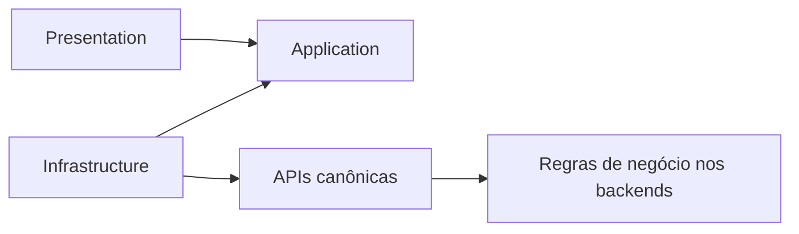

# Arquitetura e guardrails

## Princípio

O `oficina-ui` é uma interface operacional, não um domínio adicional. Ele coordena interação e apresenta respostas; os serviços decidem o resultado.



## Fronteiras

| Camada | Pode conter | Não pode conter |
|---|---|---|
| `presentation` | componentes, páginas, formulários, rotas, view state | HTTP direto, DTO externo, regra de negócio |
| `application` | coordenação, ports, estado efêmero, comandos da UI | cálculo financeiro, transição de estado, autorização definitiva |
| `infrastructure` | adapters HTTP, DTOs, mappers, sessão, configuração | componentes, decisão de negócio, estado visual |
| `shared/ui` | elementos visuais reutilizáveis | semântica de Cliente, OS, Billing ou Execution |
| `core` | autenticação, erro, correlação e configuração transversal | features ou abstrações genéricas sem uso comprovado |

## Exemplos proibidos

```typescript
// Proibido: reproduz uma transição de negócio.
const podeIniciarReparo = os.estado === 'EM_EXECUCAO' && estoqueDisponivel;

// Proibido: calcula valor pertencente ao Billing.
const total = itens.reduce((soma, item) => soma + item.valor * item.quantidade, 0);
```

A UI deve apresentar ações fornecidas ou aceitas pela API e tratar a eventual rejeição canônica. Ocultar uma ação por papel ou estado recebido é somente melhoria de experiência; nunca é controle de segurança.

## Guardrails automatizados planejados

- ESLint com zero warnings e proibição de `any`/imports restritos;
- TypeScript estrito;
- teste de dependências entre camadas e features;
- busca por `HttpClient` fora de `infrastructure`/`core/http`;
- testes de adapters e mappers;
- orçamento de bundle e build de produção;
- testes E2E e acessibilidade dos fluxos principais;
- auditoria de dependências e Quality Gate.

Esses controles serão materializados junto ao scaffold Angular em `UI-BOOT-001` e `UI-ARCH-002`.
