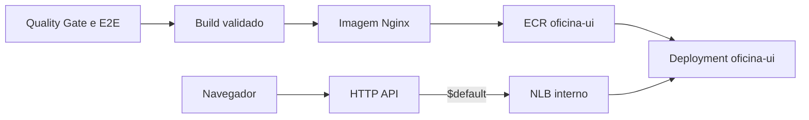

# Deploy no lab

A UI é publicada como container Nginx em um workload opcional do EKS. Ela reutiliza o HTTP API e o VPC Link do lab, mas não participa dos deploys dos backends nem se torna requisito da infraestrutura principal.

## Fluxo

As rotas explícitas de autenticação e `/api/v1` prevalecem sobre `$default`; a raiz e os caminhos da SPA são atendidos pela UI. O Nginx usa `try_files` para retornar `index.html` após F5 em uma rota Angular.

## Pré-requisitos

1. O branch `main` do `oficina-infra` deve publicar os outputs do EKS, HTTP API e VPC Link usados pelo state opcional.
2. Configure no `oficina-ui` os secrets AWS temporários usados pelos demais repositórios.
3. Opcionalmente configure `AWS_REGION`, overrides do backend Terraform, `UI_API_BASE_URL`, `UI_AUTH_BASE_URL` ou `UI_OBSERVABILITY_ENDPOINT`.

Sem overrides, o pipeline deriva os endpoints do state principal. Em seguida, aplica o state opcional, publica a imagem no ECR, materializa o ConfigMap de runtime e aguarda o rollout.

## Garantias de publicação

- o deploy só começa depois de Quality Gate, testes e E2E;
- a imagem contém exatamente o artefato produzido pelo Quality Gate, sem recompilar;
- a imagem executa como usuário não-root e o pod usa filesystem somente leitura;
- endpoints e metadados são montados por ConfigMap, sem secrets no bundle;
- readiness e liveness usam `/healthz`;
- o rollout falha se o pod não ficar pronto em cinco minutos;
- cada imagem recebe a tag imutável do commit e a conveniência `latest`.

Após um push em `main`, a URL, imagem e revisão aparecem no summary do workflow `Deploy UI Lab`.
