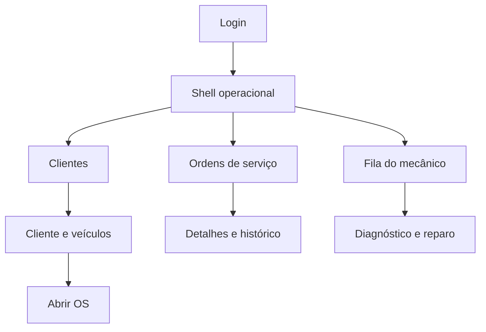
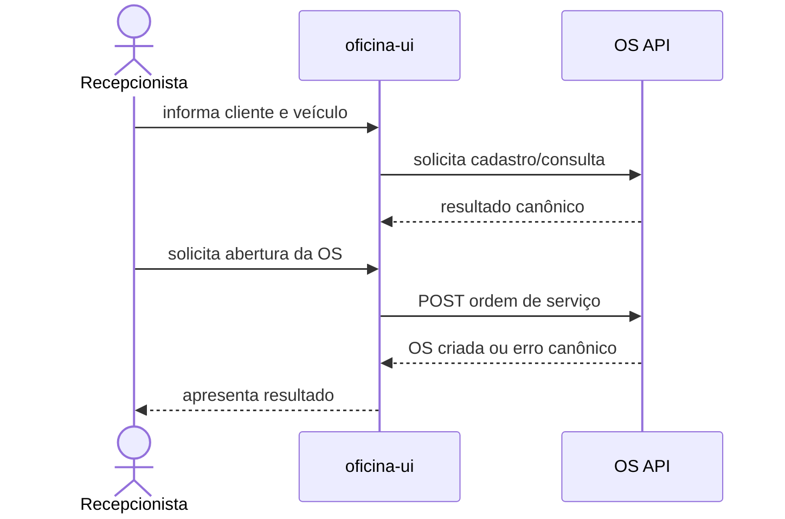
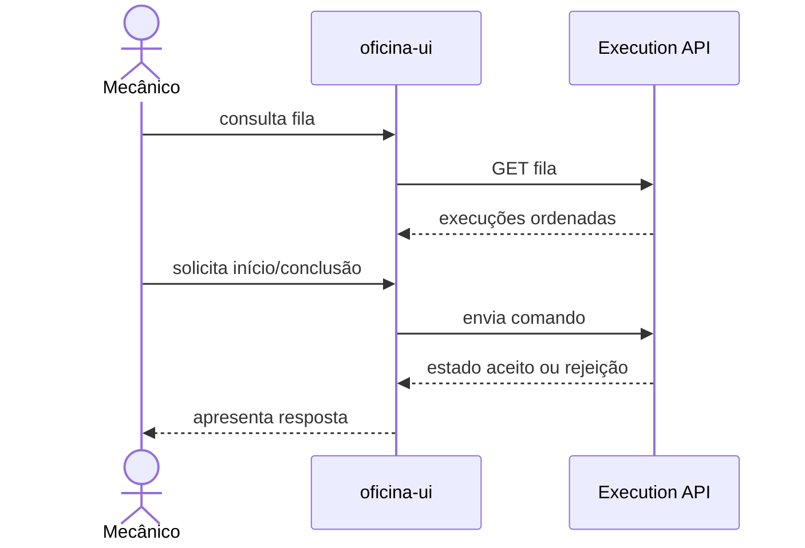

# Escopo do frontend operacional

## Personas do MVP

| Persona        | Necessidade principal                              | Escopo inicial                                                   |
| -------------- | -------------------------------------------------- | ---------------------------------------------------------------- |
| Recepcionista  | registrar chegada e acompanhar atendimento         | login, clientes, veículos, abertura e consulta de OS             |
| Mecânico       | visualizar trabalho e registrar diagnóstico/reparo | login, fila, detalhes da execução, início e conclusão das etapas |
| Administrativo | acessar e apoiar os fluxos operacionais            | mesmos fluxos do MVP conforme autorização das APIs               |

Portal do cliente, gestão completa de usuários, estoque, financeiro e dashboards não pertencem ao MVP.

## Mapa de navegação

## Fluxos do MVP

### Atendimento

### Execução

## Critérios de experiência

Cada página deve prever carregamento, ausência de dados, indisponibilidade, erro de validação, rejeição de negócio, conflito idempotente, expiração da sessão e tentativa de operação não autorizada.
